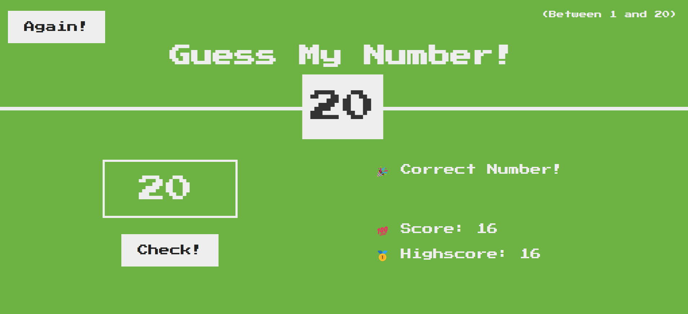

# Guess-my-Number

## Table of contents

- [The challenge](#the-challenge)
- [Screenshot](#screenshot)
- [Links](#links)
- [My process](#my-process)
- [Built with](#built-with)
- [What I learned](#what-i-learned)
- [Continued development](#continued-development)
- [Useful resources](#useful-resources)
- [Author](#author)
- [Acknowledgments](#acknowledgments)

## The challenge

Users should be able to:

- should be able to select a random number between 1 and 20 .
- to check and see if is the winner.
  -to see the score and highscore
  -to restart the game by pressing the again button.

## Links

[](https://miron-silviu.github.io/Guess-my-Number/)

## Screenshot

<!-- TODO -->



## Built with

- Semantic HTML5 markup
- CSS custom properties
- Flexbox
  -javascript
- [Styled Components](https://styled-components.com/) - For styles

## What I learned

Building this project I learned:

1- What is Dom and Dom manipulation
2-Select and manipulate elements
3-Handaling click events
4-Implemnting the game logic
5-Manipulating css
6-Code refactoring and using DRY principle.

```html
<body>
  <header>
    <h1>Guess My Number!</h1>
    <p class="between">(Between 1 and 20)</p>
    <button class="btn again">Again!</button>
    <div class="number">?</div>
  </header>
  <main>
    <section class="left">
      <input type="number" class="guess" />
      <button class="btn check">Check!</button>
    </section>
    <section class="right">
      <p class="message">Start guessing...</p>
      <p class="label-score">💯 Score: <span class="score">20</span></p>
      <p class="label-highscore">
        🥇 Highscore: <span class="highscore">0</span>
      </p>
    </section>
  </main>
  <script src="script.js"></script>
</body>
```

```css
.proud-of-this-css {
  .number {
    background: #eee;
    color: #333;
    font-size: 6rem;
    width: 15rem;
    padding: 3rem 0rem;
    text-align: center;
    position: absolute;
    bottom: 0;
    left: 50%;
    transform: translate(-50%, 50%);
  }
}
```

```js
const proudOfThisFunc = () => {
  let secretNumber = Math.trunc(Math.random() * 20) + 1;
  console.log(secretNumber);
  let score = 20;
  let highscore = 0;

  const displayMessage = function (message) {
    document.querySelector('.message').textContent = message;
  };

  document.querySelector('.check').addEventListener('click', function () {
    const guess = Number(document.querySelector('.guess').value);
    console.log(guess, typeof guess);

    // When there is no input
    if (!guess) {
      displayMessage('⛔ No number!');

      // When player wins
    } else if (guess === secretNumber) {
      displayMessage('🎉 Correct Number!');
      document.querySelector('.number').textContent = secretNumber;

      document.querySelector('body').style.backgroundColor = '#60b347';

      document.querySelector('.number').style.with = '30rem';
      if (score > highscore) {
        highscore = score;
        document.querySelector('.highscore').textContent = highscore;
      }

      // when guess is wroang
    } else if (guess !== secretNumber) {
      if (score > 1) {
        displayMessage(guess > secretNumber ? '📈 To high!' : ' 📈 To low!');
        score--;

        document.querySelector('.score').textContent = score;
      } else {
        displayMessage(' 💥You lost the game !');
        document.querySelector('.score').textContent = 0;
      }
    }
  });
};
```

## Author

- Website - [Add your name here](https://www.your-site.com)
- Frontend Mentor - [Silviu Miron](https://www.frontendmentor.io/home)
- Twitter - [Silviu Miron](https://x.com/home)
